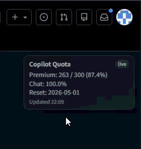

# Show Copilot Usage
Tampermonkey userscript for showing Copilot quota on GitHub pages.

## Description
Displays a compact quota widget near the top-right area on any GitHub page, refreshes every 5 minutes, and falls back to last successful data when the API request fails.

Shown fields:
- Premium interactions: remaining / total
- Premium interactions percentage
- Chat percentage
- Reset date

## Install
[Show Copilot Usage](https://github.com/PeterChen-eaton/userscripts/raw/refs/heads/main/show-copilot-usage/script.user.js)

## Notes
- Requires a logged-in GitHub session.
- When fetch fails, the widget shows cached data and marks it as stale.

## Example
